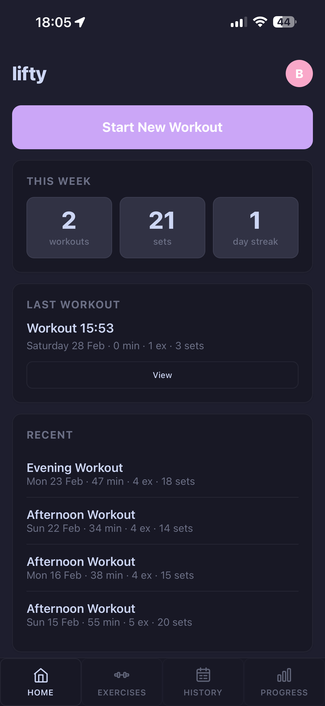
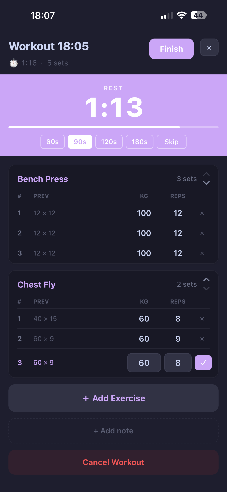
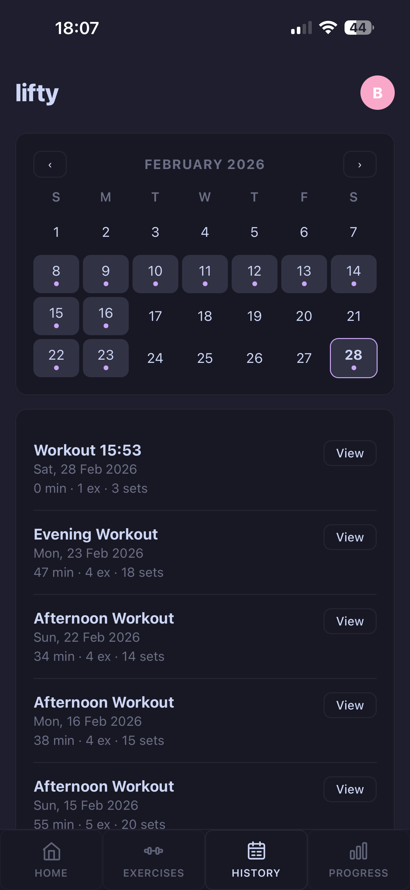
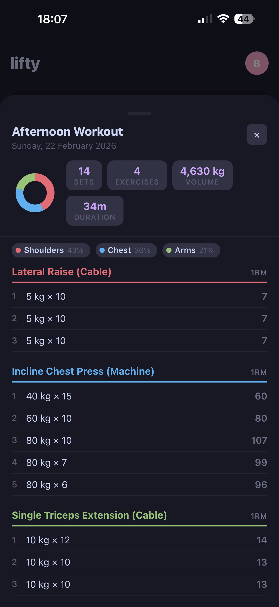
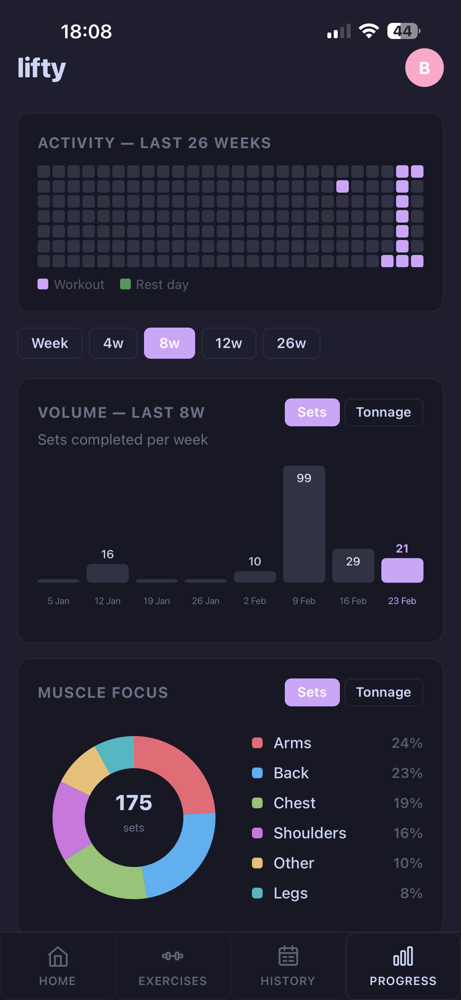
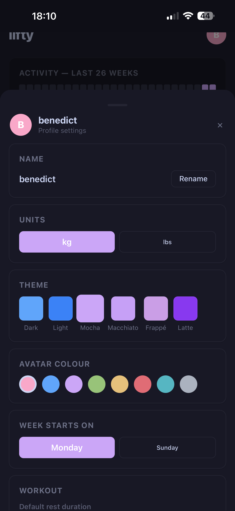

# lifty

> A self-hosted, privacy-first workout tracker. No accounts, no cloud, no subscriptions — just your data on your own server.

**FastAPI · React PWA · SQLite · Docker Compose**

---

## Screenshots

<p align="center">
  
  
  
  
  
  
</p>

---

## Features

### Workouts
- Start a workout, add exercises on the fly, log sets with weight + reps
- Previous session's sets shown inline as reference
- Reorder exercises during a workout
- Rename workouts, add notes
- Mark rest days from the home screen

### Rest Timer
- Configurable duration (60 / 90 / 120 / 180s) saved per profile
- Web Audio ding + vibration on finish
- Background-accurate — stays correct after screen lock or tab switch
- Push notification fires even when the screen is off (Android + iOS PWA)

### Progress & History
- Full workout log with monthly calendar view
- Per-workout detail sheet — stats, muscle group breakdown, sets with estimated 1RM
- PRs per exercise (Epley 1RM), grouped by body part
- Weekly / daily volume bar chart (sets or tonnage)
- Muscle group donut chart
- 26-week activity heatmap

### Profiles & Settings
- Multiple profiles on a single instance
- Per-profile: unit (kg / lbs), theme, avatar colour, week start day, rest duration, ding toggle
- Themes: Dark, Light, Catppuccin Mocha / Macchiato / Frappé / Latte

### Import & Export
- Strong CSV import — bring in your full workout history
- CSV export per profile

### PWA
- Installable on iOS and Android
- Offline support via service worker
- Flamingo barbell icon, themed status bar

---

## PWA & Service Worker

The service worker provides two things:

| Feature | How it works |
|---|---|
| **Offline support** | Static assets cached on first load; API falls back to cached responses when offline |
| **Background notifications** | Rest timer end time posted to SW on start; SW fires `showNotification` at the right time regardless of whether the page is suspended |

**Platform support:**

| Platform | Offline | Background notification |
|---|---|---|
| Android | ✅ | ✅ |
| iOS 16.4+ (PWA) | ✅ | ✅ — add to home screen first |
| iOS < 16.4 / desktop | ✅ | ❌ — in-page ding still works when visible |

---

## Stack

| Layer | Tech |
|---|---|
| Backend | FastAPI + SQLModel + SQLite, Python 3.11 |
| Frontend | React 18 + Vite + plain CSS |
| Serving | nginx (frontend), uvicorn (backend) |
| Containers | Docker + Docker Compose |
| CI | GitHub Actions → `ghcr.io` (amd64 + arm64) |

---

## Running locally

```bash
./scripts/dev_up.sh
```

Builds both containers and seeds the exercise library.

| Service | URL |
|---|---|
| Frontend | http://localhost:5173 |
| Backend API | http://localhost:8000 |
| API docs | http://localhost:8000/docs |

**Reset the database:**
```bash
rm data/lifty.db && docker compose restart backend
```

---

## Self-hosting

Images are built and pushed to `ghcr.io` on every push to `main`.

```bash
docker compose -f docker-compose.prod.yml pull
docker compose -f docker-compose.prod.yml up -d
```

Update the volume path in `docker-compose.prod.yml` to wherever you want the SQLite database stored on your host.

```
ghcr.io/bndct-devops/lifty-backend:latest   # amd64 + arm64
ghcr.io/bndct-devops/lifty-frontend:latest  # amd64 + arm64
```

---

## Project structure

```
backend/
  main.py              # FastAPI app, all endpoints
  models.py            # SQLModel table definitions
  schemas.py           # Pydantic request/response types
  db.py                # engine + table creation
  seed_exercises.py    # built-in exercise library (runs on startup)
frontend/
  public/
    sw.js              # service worker — offline cache + background notifications
    manifest.json      # PWA manifest
    favicon.svg        # flamingo barbell icon
  src/
    App.jsx            # entire frontend
    api.js             # fetch wrappers for all backend endpoints
    styles.css         # CSS custom properties + layout
  nginx.conf           # proxies /api/* to backend
scripts/
  dev_up.sh            # one-command local dev start
docker-compose.yml         # local dev (builds from source)
docker-compose.prod.yml    # production (pulls from ghcr.io)
.github/workflows/
  build-push.yml       # CI: build multi-arch images, push to ghcr.io
```

